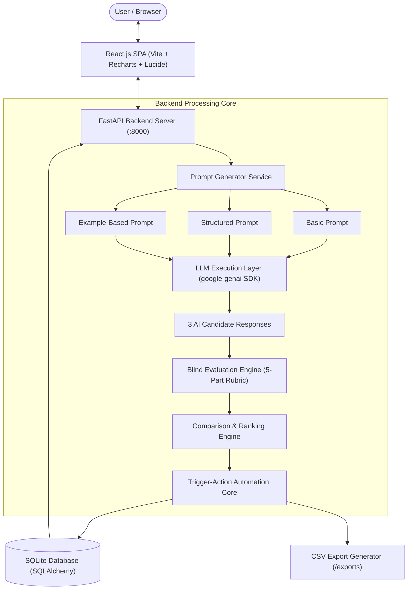
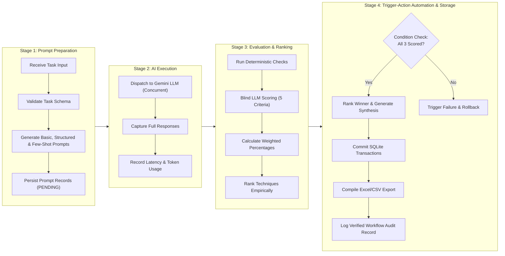
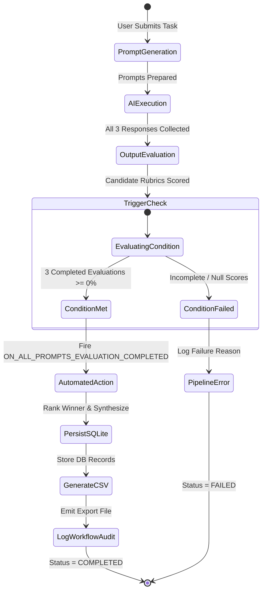

# System Architecture & Workflow Diagrams

## 1. High-Level System Architecture

```mermaid
flowchart TD
    User([User / Browser]) <--> ReactFrontend["React.js SPA (Vite + Recharts + Lucide)"]
    ReactFrontend <--> FastAPIServer["FastAPI Backend Server (:8000)"]

    subgraph BackendEngine["Backend Processing Core"]
        FastAPIServer --> PGen["Prompt Generator Service"]
        PGen --> PBasic["Basic Prompt"]
        PGen --> PStruct["Structured Prompt"]
        PGen --> PEx["Example-Based Prompt"]

        PBasic & PStruct & PEx --> LLMClient["LLM Execution Layer (google-genai SDK)"]
        LLMClient --> AIResp["3 AI Candidate Responses"]

        AIResp --> Evaluator["Blind Evaluation Engine (5-Part Rubric)"]
        Evaluator --> Ranking["Comparison & Ranking Engine"]
        Ranking --> Automation["Trigger-Action Automation Core"]
    end

    Automation --> SQLiteDB[("SQLite Database (SQLAlchemy)")]
    Automation --> CSVReport["CSV Export Generator (/exports)"]
    SQLiteDB --> FastAPIServer
```

---

## 2. Four-Stage Processing Workflow & State Machine

```mermaid
flowchart LR
    subgraph S1["Stage 1: Prompt Preparation"]
        A1["Receive Task Input"] --> A2["Validate Task Schema"]
        A2 --> A3["Generate Basic, Structured & Few-Shot Prompts"]
        A3 --> A4["Persist Prompt Records (PENDING)"]
    end

    subgraph S2["Stage 2: AI Execution"]
        B1["Dispatch to Gemini LLM (Concurrent)"] --> B2["Capture Full Responses"]
        B2 --> B3["Record Latency & Token Usage"]
    end

    subgraph S3["Stage 3: Evaluation & Ranking"]
        C1["Run Deterministic Checks"] --> C2["Blind LLM Scoring (5 Criteria)"]
        C2 --> C3["Calculate Weighted Percentages"]
        C3 --> C4["Rank Techniques Empirically"]
    end

    subgraph S4["Stage 4: Trigger-Action Automation & Storage"]
        D1{"Condition Check:\nAll 3 Scored?"} -- Yes --> D2["Rank Winner & Generate Synthesis"]
        D2 --> D3["Commit SQLite Transactions"]
        D3 --> D4["Compile Excel/CSV Export"]
        D4 --> D5["Log Verified Workflow Audit Record"]
        D1 -- No --> D6["Trigger Failure & Rollback"]
    end

    S1 --> S2 --> S3 --> S4
```

---

## 3. Trigger-Action State Transition

```mermaid
stateDiagram-v2
    [*] --> PromptGeneration: User Submits Task
    PromptGeneration --> AIExecution: Prompts Prepared
    AIExecution --> OutputEvaluation: All 3 Responses Collected
    OutputEvaluation --> TriggerCheck: Candidate Rubrics Scored

    state TriggerCheck {
        [*] --> EvaluatingCondition
        EvaluatingCondition --> ConditionMet: 3 Completed Evaluations >= 0%
        EvaluatingCondition --> ConditionFailed: Incomplete / Null Scores
    }

    ConditionMet --> AutomatedAction: Fire ON_ALL_PROMPTS_EVALUATION_COMPLETED
    AutomatedAction --> PersistSQLite: Rank Winner & Synthesize
    PersistSQLite --> GenerateCSV: Store DB Records
    GenerateCSV --> LogWorkflowAudit: Emit Export File
    LogWorkflowAudit --> [*]: Status = COMPLETED

    ConditionFailed --> PipelineError: Log Failure Reason
    PipelineError --> [*]: Status = FAILED
```

